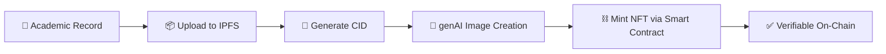

<div align="center">

# 🎓 MINTSEM

### Academic Records Authentication System using Blockchain and NFTs


</div>

---

## 🚀 Overview

MINTSEM leverages **blockchain technology** and **Non-Fungible Tokens (NFTs)** to create a secure and immutable system for managing academic records. By combining **IPFS** for decentralized file storage with **generative AI** for NFT creation, the system ensures the integrity and credibility of academic documents while enabling instant, trustless verification.

---

## ✨ Features

| Feature | Description |
|---|---|
| 🗄️ **Decentralized Storage** | Academic records stored on IPFS — tamper-proof and censorship-resistant |
| 🎨 **AI-Generated NFTs** | Each record is minted as an NFT via Starton smart contracts, with genAI-generated artwork |
| 🔒 **Immutable Records** | Blockchain guarantees records can't be altered after issuance |
| 🔍 **Transparent History** | Every change made by the issuing organization is logged on-chain |
| ✅ **Instant Verification** | Anyone can verify a credential by checking its NFT |
| 🤝 **Third-Party Trust** | Employers verify authenticity without touching sensitive data |
| 🍃 **MongoDB Backed** | Records and metadata managed through MongoDB |

---

## 🏗️ How It Works



1. **IPFS Integration** — records uploaded to IPFS, CID generated and stored
2. **NFT Generation** — genAI creates unique artwork per record, CID embedded as metadata
3. **Smart Contract Minting** — NFT issuance and verification handled on-chain
4. **User Interface** — students manage records; third parties verify with one click
5. **Blockchain Layer** — ensures immutability and public transparency

---

## 🧑‍💻 Usage

### Academic Record Issuance
- An institution uploads records, which triggers NFT generation
- Only authorized personnel can upload/manage records

### Third-Party Verification
- Employers or institutions verify authenticity by checking blockchain-linked NFTs
- No sensitive data exposure required

---

## ⚙️ Setup

### 1. Install Dependencies

**Frontend**
```bash
cd frontend
npm install
```

**Backend**
```bash
cd backend
npm install
```

### 2. Configure Environment Variables

Create a `.env` file in `backend/` and `frontend/` — **never commit real secrets**:

```env
# backend/.env
AZURE_CLIENT_ID=your_client_id
AZURE_TENANT_ID=your_tenant_id
AZURE_CLIENT_SECRET=your_client_secret

# frontend/.env
REACT_APP_STARTON_API_KEY=your_starton_key
REACT_APP_HF_TOKEN=your_huggingface_token
```

### 3. Configure IPFS

Run a local IPFS node or use a public IPFS gateway — no code changes required.

### 4. Run

```bash
# Terminal 1
cd backend
npm start

# Terminal 2
cd frontend
npm start
```

---

## 🧪 Testing

Run unit and integration tests across both frontend and backend to validate uploads, NFT minting, and verification flows before deploying.

---

## 🌱 Future Scope

Currently records are pulled from a manually populated MongoDB instance. Planned: direct integration with institute databases for automated record ingestion.

---

## 👥 Contributors

| | |
|---|---|
| 🧑‍💻 **Maintained by** | Abhigyan Singh — *Software Engineer* |

---

## 🙏 Acknowledgements

Thanks to the creators of IPFS, genAI, and blockchain technologies that made this project possible.

<div align="center">

**⭐ If you found this project interesting, consider giving it a star!**

</div>
